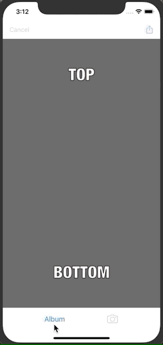

# MemeMe 1.0
MemeMe is an app for iPhone and iPad that lets you create memes from photos taken by the camera or with existing images on your phone. The app was created for the second project in the Udacity iOS Nanodegree. It has been tested on Xcode 11.4.1 and iOS 13.4.

